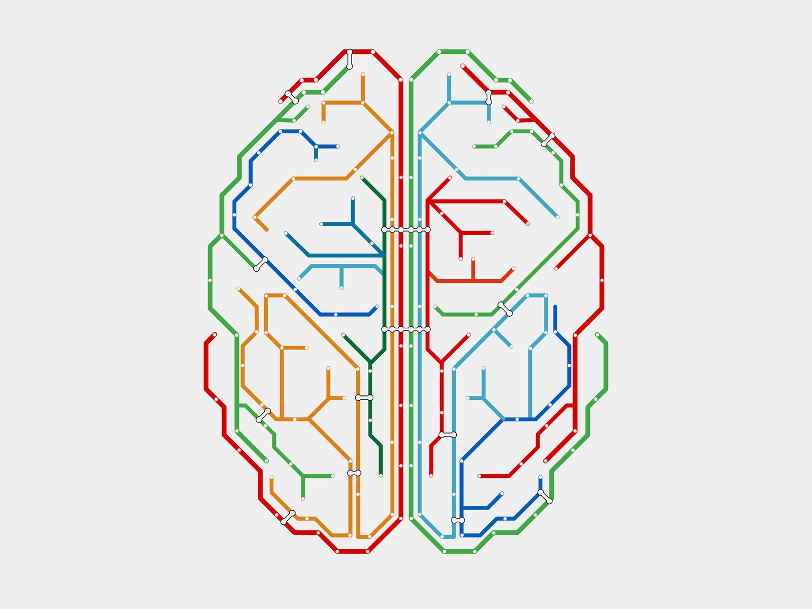

# Machine Learning Curriculum

Machine Learning is a branch of Artificial Intelligence dedicated at making
machines learn from observational data without being explicitly programmed.

> Machine learning and AI are not the same. Machine learning is an instrument in
> the AI symphony — a component of AI. So what is Machine Learning — or ML —
> exactly? It’s the ability for an algorithm to learn from prior data in order
> to produce a behavior. ML is teaching machines to make decisions in situations
> they have never seen.

## Machine Learning in General

Study this section to understand fundamental concepts and develop intuitions before going any deeper.

> A computer program is said to learn from experience `E` with respect to some
> class of tasks `T` and performance measure `P` if its performance at tasks in
> `T`, as measured by `P`, improves with experience `E`.

* [Machine Learning Crash Course with TensorFlow APIs](https://developers.google.com/machine-learning/crash-course/) Google's fast-paced, practical introduction to machine learning
* [Artificial Intelligence, Revealed](https://code.facebook.com/pages/1902086376686983) a quick introduction by Yann LeCun, mostly about Machine Learning ideas, Deep Learning, and convolutional neural network
* [How do I learn machine learning? - Quora](https://www.quora.com/How-do-I-learn-machine-learning-1)
* [Intro to Machine Learning - Udacity](https://www.udacity.com/course/intro-to-machine-learning--ud120) hands on scikit-learn (python) programming learning on core ML concepts
* [Machine Learning: Supervised, Unsupervised & Reinforcement - Udacity](https://www.udacity.com/course/machine-learning--ud262) the 2 instructors are hilarious
* [Machine Learning Mastery](http://machinelearningmastery.com/start-here/) very carefully laid out step-by-step guide to some particular algorithms, though contains inaccuracies about general principles such as the bias-variance tradeoff.
* [Andrew Ng's Course on Coursera](https://www.coursera.org/learn/machine-learning) recommended for people who want to know the details of ML algorithms under the hood, understand enough maths to be dangerous and do coding assignments in Octave programming language (Note: Andrew said that you do not need to know Calculus beforehand but he talked about it quite often so you will regret if you don't know Calculus :laughing:)
* [ML Recipes - YouTube Playlist](https://www.youtube.com/playlist?list=PLOU2XLYxmsIIuiBfYad6rFYQU_jL2ryal) a really nicely designed concrete actionable content for ML introduction
* [Machine Learning is Fun Part 1](https://medium.com/@ageitgey/machine-learning-is-fun-80ea3ec3c471) simple approach to machine learning for non-maths people
* [Machine Learning with Python - YouTube Playlist](https://www.youtube.com/playlist?list=PLQVvvaa0QuDfKTOs3Keq_kaG2P55YRn5v)
* [Machine Learning Yearning by Andrew Ng](http://www.mlyearning.org/)
* [Machine Learning Crash Course: Part 1](https://ml.berkeley.edu/blog/2016/11/06/tutorial-1/)
* [https://www.kadenze.com/courses/machine-learning-for-musicians-and-artists-iv](https://www.kadenze.com/courses/machine-learning-for-musicians-and-artists-iv)
* [Rules of Machine Learning: Best Practices for ML Engineering](http://martin.zinkevich.org/rules_of_ml/rules_of_ml.pdf)
* [Most Shared Machine Learning Content on Twitter For The Past 7 Days](http://theherdlocker.com/tweet/popularity/machinelearning)
* [MIT 6.S099: Artificial General Intelligence](https://agi.mit.edu/) This class takes an engineering approach to exploring possible research paths toward building human-level intelligence.

## Reinforcement Learning

Building a machine that senses the environment and then chooses the best policy
(action) to do at any given state to maximize its expected long-term scalar
reward is the goal of reinforcement learning.

* [Basic Reinforcement Learning | GitHub](https://github.com/vmayoral/basic_reinforcement_learning) An introduction series to Reinforcement Learning (RL) with comprehensive step-by-step tutorials.
* [Advanced Topics: RL 2015 (COMPM050/COMPGI13)](http://www0.cs.ucl.ac.uk/staff/D.Silver/web/Teaching.html) by [David Silver](http://www0.cs.ucl.ac.uk/staff/d.silver/web/Home.html) (the guy behind [AlphaGo](https://deepmind.com/research/alphago/))
* [An Introduction Book by Richard S. Sutton and Andrew G. Barto](https://webdocs.cs.ualberta.ca/~sutton/book/ebook/the-book.html)
* [Deep Reinforcement Learning: Pong from Pixels](http://karpathy.github.io/2016/05/31/rl/)
* [Lecture 10: Reinforcement Learning - YouTube](https://www.youtube.com/watch?v=IXuHxkpO5E8)
* [A Survey Paper](https://www.jair.org/media/301/live-301-1562-jair.pdf)
* [Deep Reinforcement Learning: A Tutorial - OpenAI](https://gym.openai.com/docs/rl)
* [CS 294: Deep Reinforcement Learning, Spring 2017](http://rll.berkeley.edu/deeprlcourse/)

## Deep Learning

Deep learning is a branch of machine learning where deep artificial neural
networks (DNN) — algorithms inspired by the way neurons work in the brain — find
patterns in raw data by combining multiple layers of artificial neurons. As the
layers increase, so does the neural network’s ability to learn increasingly
abstract concepts.

The simplest kind of DNN is
a [Multilayer Perceptron](https://en.wikipedia.org/wiki/Multilayer_perceptron)
(MLP).

* [DeepLearning.ai](https://www.deeplearning.ai/) new 5 courses specialization taught by Andrew Ng at Coursera; It's the sequel of [Machine Learning course](https://www.coursera.org/learn/machine-learning) at Coursera.
* [Advanced Machine Learning Specialization | Coursera](https://www.coursera.org/specializations/aml) consists of 7 courses
* [A friendly introduction to Deep Learning and Neural Networks](https://www.youtube.com/watch?v=BR9h47Jtqyw)
* [A Neural Network Playground](http://playground.tensorflow.org/) Tinker with a simple neural network designed to help you visualize the learning process
* [Deep Learning Demystified - Youtube](https://www.youtube.com/watch?v=Q9Z20HCPnww) explain inspiration of deep learning from real neurons to artificial neural networks
* [Learn TensorFlow and deep learning, without a Ph.D.](https://cloud.google.com/blog/big-data/2017/01/learn-tensorflow-and-deep-learning-without-a-phd) This 3-hour course (video + slides) offers developers a quick introduction to deep-learning fundamentals, with some TensorFlow thrown into the bargain.
* [A Guide to Deep Learning by YN^2](http://yerevann.com/a-guide-to-deep-learning/) a curated maths guide to Deep Learning
* [Practical Deep Learning For Coders Course at Fast.ai](http://course.fast.ai/) taught by Jeremy Howard (Kaggle's #1 competitor 2 years running, and founder of Enlitic)
* [Deep learning - Udacity](https://www.udacity.com/course/deep-learning--ud730) recommended for visual learner who knows some ML, this course provides high level ideas of deep learning, dense intuitive details put in a short amount of time, you will use TensorFlow inside the course
* [Deep Learning Resources (Papers, Online Courses, Books) - deeplearning4j.org](http://deeplearning4j.org/deeplearningpapers.html)
* [Introduction to Deep Neural Networks - deeplearning4j.org](http://deeplearning4j.org/neuralnet-overview.html)
* [NVIDIA Deep Learning Institute](https://developer.nvidia.com/deep-learning-courses) because GPU are efficient at training Neural Networks, NVIDIA notices this market !
* [Deep Learning Book](http://www.deeplearningbook.org/) recommended for math
  nerds who want to understand the theoretical side, the book is crafted by our
  deep learning wizards (Goodfellow, Bengio and Courville)
* [Unsupervised Feature Learning and Deep Learning](http://ufldl.stanford.edu/wiki/index.php/Main_Page)
* [DeepMind Publications](https://deepmind.com/publications.html)
* [DeepLearning.TV - YouTube](https://www.youtube.com/channel/UC9OeZkIwhzfv-_Cb7fCikLQ) broad overview of deep learning, no implementation, just pure ideas
* [CS224d: Deep Learning for Natural Language Processing](http://cs224d.stanford.edu/)
* [Deep Learning Summer School, Montreal 2015](http://videolectures.net/deeplearning2015_montreal/)
* [UFLDL Deep Learning Tutorial](http://deeplearning.stanford.edu/tutorial/)
* [Neural networks class - YouTube Playlist](https://www.youtube.com/playlist?list=PL6Xpj9I5qXYEcOhn7TqghAJ6NAPrNmUBH)
* [http://deeplearning.net/](http://deeplearning.net/)
* [https://developer.nvidia.com/deep-learning](https://developer.nvidia.com/deep-learning)
* [http://neuralnetworksanddeeplearning.com/index.html](http://neuralnetworksanddeeplearning.com/index.html) a hands-on online book for deep learning maths intuition, I can say that after you finish this, you will be able to explain deep learning in a fine detail.
* [https://github.com/lisa-lab/DeepLearningTutorials](https://github.com/lisa-lab/DeepLearningTutorials)
* [https://www.kadenze.com/courses/creative-applications-of-deep-learning-with-tensorflow-i](https://www.kadenze.com/courses/creative-applications-of-deep-learning-with-tensorflow-i) You will implement a lot of things inside TensorFlow such as Autoencoders, Convolutional neural net, Feedforward neural nets, Generative models (Generative Adversarial Networks, Recurrent networks), visualizing the network, etc. You will have lots of assignments to finish. The course director (Parag) is also approachable and active.
* [Deep Learning Lectures by Yann LeCun](https://www.college-de-france.fr/site/en-yann-lecun/course-2015-2016.htm) Why not learn Deep Learning from the guy who invented Convolutional nets?
* [6.S094: Deep Learning for Self-Driving Cars](http://selfdrivingcars.mit.edu/) a course at MIT
* [The Neural Network Zoo](http://www.asimovinstitute.org/neural-network-zoo/) a bunch of neural network models that you should know about (I know about half of them so don't worry that you don't know many because most of them are not popular or useful in the present)
* [6.S191: Introduction to Deep Learning](http://introtodeeplearning.com/) a course for 2017
* [The GAN Zoo](https://github.com/hindupuravinash/the-gan-zoo/blob/master/README.md) a list of GAN papers which have their own name
* [A Microsoft CNTK tutorial in Python – build a neural network](http://adventuresinmachinelearning.com/microsoft-cntk-tutorial/) a comprehensive introductory tutorial for Microsoft's CNTK framework

### Convolutional Neural Networks

DNNs that work with grid data like sound waveforms, images and videos better
than ordinary DNNs. They are based on the assumptions that nearby input units
are more related than the distant units. They also utilize translation
invariance. For example, given an image, it might be useful to detect the same
kind of edges everywhere on the image.
They are sometimes called **convnets** or **CNNs**.

* [CS231n: Convolutional Neural Networks for Visual Recognition](http://cs231n.stanford.edu/) a course taught at Stanford university
* [How Convolutional Neural Networks work - Youtube](https://www.youtube.com/watch?v=FmpDIaiMIeA) technical
  explanation including pooling operations, ReLU, fully connected layer,
  optimization using gradient descent
* [Neural Network that Changes Everything - Computerphile](https://www.youtube.com/watch?v=py5byOOHZM8)
* [A Beginner's Guide To Understanding Convolutional Neural Networks](https://adeshpande3.github.io/adeshpande3.github.io/A-Beginner%27s-Guide-To-Understanding-Convolutional-Neural-Networks/)
* [Deep Learning for Computer Vision (Andrej Karparthy, OpenAI)](https://www.youtube.com/watch?v=u6aEYuemt0M) this
  is my most favorite video of convolutional net. Andrej explains convnet in
  detail answering all the curious questions that one might have. For example,
  most articles only talk about convolution in grayscale image, but he describe
  convolution in images with color channels as well. He also talks about the
  concerns and the assumptions that convnets make. This is a great lecture!
* [Understanding Neural Networks Through Deep Visualization](http://yosinski.com/deepvis) explains
  how to visualize a convnet using various techniques
* [Convolutional Neural Networks Tutorial in TensorFlow](http://adventuresinmachinelearning.com/convolutional-neural-networks-tutorial-tensorflow/) gives an introduction to CNNs for beginners in TensorFlow
* [Capsule Networks (CapsNets) – Tutorial](https://www.youtube.com/watch?v=pPN8d0E3900) CapsNets are a hot new architecture for neural networks, invented by Geoffrey Hinton, one of the godfathers of deep learning.

### Recurrent Neural Networks

DNNs that have states. They also understand sequences that vary in length.
They are sometimes called **RNNs**.

* [http://karpathy.github.io/2015/05/21/rnn-effectiveness/](http://karpathy.github.io/2015/05/21/rnn-effectiveness/)
* [http://colah.github.io/posts/2015-08-Understanding-LSTMs/](http://colah.github.io/posts/2015-08-Understanding-LSTMs/)
* [http://www.wildml.com/2015/09/recurrent-neural-networks-tutorial-part-1-introduction-to-rnns/](http://www.wildml.com/2015/09/recurrent-neural-networks-tutorial-part-1-introduction-to-rnns/)

### Best Practices
* [How to debug neural networks. Manual.](https://hackernoon.com/how-to-debug-neural-networks-manual-dc2a200f10f2)
* [An overview of gradient descent optimization algorithms](http://sebastianruder.com/optimizing-gradient-descent/index.html)

## Open Source Trained Models
* [https://modelzoo.co/](https://modelzoo.co/) Model Zoo
* [Self-Driving Car by Udacity](https://github.com/udacity/self-driving-car)
* [deepdream](https://github.com/google/deepdream) inceptionism - a deep model that takes an image and hallucinates animals/buildings from it
* [Magenta: Music and Art Generation with Machine Intelligence](https://github.com/tensorflow/magenta)
* [SyntaxNet](https://github.com/tensorflow/models/tree/master/syntaxnet) (Parsey McParseface)
* [Neural Storyteller](https://github.com/ryankiros/neural-storyteller) convert image caption into a romantic one
* [https://github.com/facebookresearch/deepmask](https://github.com/facebookresearch/deepmask) sharp object segmentation on image at pixel-level
* [https://github.com/facebookresearch/multipathnet](https://github.com/facebookresearch/multipathnet) convnet for classifying DeepMask+SharpMask model above
* [https://github.com/facebookresearch/fastText](https://github.com/facebookresearch/fastText) Library for fast text representation and classification; [Tutorial](https://github.com/miguelgfierro/sciblog_support/blob/master/Intro_to_NLP_with_fastText/Intro_to_NLP.ipynb)
* [https://github.com/tensorflow/models](https://github.com/tensorflow/models)
* [https://github.com/google/seq2seq](https://github.com/google/seq2seq) A
  general-purpose encoder-decoder framework for Tensorflow (you need to provide
  it a sequence of vectors as input and also provide sequence of vectors as
  output to train this deep RNN)
* [https://github.com/phillipi/pix2pix](https://github.com/phillipi/pix2pix)
  Image-to-image translation using conditional adversarial nets;
  [TensorFlow port of pix2pix](https://github.com/affinelayer/pix2pix-tensorflow);
  Watch the presentation of this work:
  [Learning to see without a teacher](https://www.youtube.com/watch?v=ck3_7tVuCRs)

## Interesting Techniques & Applications
* [http://deeplearninggallery.com/](http://deeplearninggallery.com/) Deep Learning Gallery - a curated list of awesome deep learning projects
* [How do GANs intuitively work?](https://hackernoon.com/how-do-gans-intuitively-work-2dda07f247a1#.pqg7xhuce) this is my article explaining GANs, I try to be as intuitive as possible, GANs are so awesome that I can't just ignore and not talk about it. You can also watch the [official tutorial by Ian Goodfellow](https://channel9.msdn.com/Events/Neural-Information-Processing-Systems-Conference/Neural-Information-Processing-Systems-Conference-NIPS-2016/Generative-Adversarial-Networks).
* [https://deepart.io/](https://deepart.io/) transfer image style to other image
* [http://www.somatic.io/](http://www.somatic.io/)
* [WaveNet: A Generative Model for Raw Audio by DeepMind](https://deepmind.com/blog/wavenet-generative-model-raw-audio/)
* [Jukedeck](https://www.jukedeck.com/) Musical AI
* [StackGAN](https://github.com/hanzhanggit/StackGAN) StackGAN: Text to Photo-realistic Image Synthesis with Stacked Generative Adversarial Networks
* [Learning a Probabilistic Latent Space of Object Shapes via 3D Generative-Adversarial Modeling](http://3dgan.csail.mit.edu/) 3D-GAN,
  generating 3D models using GAN
* [BEGAN: Boundary Equilibrium Generative Adversarial Networks](https://arxiv.org/abs/1703.10717) this
  type of GAN generates more realistic images than ordinary GAN
* [Fast and Accurate Deep Network Learning by Exponential Linear Units (ELUs)](https://arxiv.org/abs/1511.07289) an
  activation function that is trying to be better than its predecessor ([ReLU](https://en.wikipedia.org/wiki/Rectifier_(neural_networks))) in a lot of way
* [Google Duplex: An AI System for Accomplishing Real-World Tasks Over the Phone](https://ai.googleblog.com/2018/05/duplex-ai-system-for-natural-conversation.html)

## Nice Blogs & Vlogs to Follow
* [http://colah.github.io/](http://colah.github.io/) this guy knows how to explain
* [https://karpathy.github.io/](https://karpathy.github.io/) this guy has taught some courses on Deep Nets
* [http://ruder.io](http://ruder.io) Sebastian Ruder's Deep Learning and NLP blog
* [http://www.wildml.com/](http://www.wildml.com/)
* [https://machinelearningmastery.com/](https://machinelearningmastery.com/) Contains a lot of content and beautiful website
* [https://adeshpande3.github.io/adeshpande3.github.io/](https://adeshpande3.github.io/adeshpande3.github.io/)
* [http://culurciello.github.io/](http://culurciello.github.io/)
* [Sirajology's YouTube Playlists](https://www.youtube.com/channel/UCWN3xxRkmTPmbKwht9FuE5A/playlists) lots of dense short hilarious introduction to ML
* [Two Minute Papers on Deep Learning Playlist](https://www.youtube.com/playlist?list=PLujxSBD-JXglGL3ERdDOhthD3jTlfudC2)
* [http://www.leviathan.ai/](http://www.leviathan.ai/)
* [Welch Labs](https://www.youtube.com/user/Taylorns34/)
* [Distill.pub](http://distill.pub/about/) A modern medium for presenting research in Machine Learning

## Impactful People
* [Geoffrey Hinton](https://en.wikipedia.org/wiki/Geoffrey_Hinton), he has been called
  the [godfather of deep learning](https://www.youtube.com/watch?v=uAu3jQWaN6E)
  by introducing 2 revolutionizing techniques (ReLU and Dropout) with his students.
  These techniques solve the Vanishing Gradient and Generalization problem of
  deep neural networks. He also taught
  a [Neural Networks course](https://www.coursera.org/learn/neural-networks) at
  Coursera.
* [Yann LeCun](https://en.wikipedia.org/wiki/Yann_LeCun), he invented CNNs
  (Convolutional neural networks), the kind of network that is really popular
  among computer vision developers today
* [Yoshua Bengio](http://www.iro.umontreal.ca/~bengioy/yoshua_en/) another
  serious professor at Deep Learning, you can
  [watch his TEDx talk here (2017)](https://www.youtube.com/watch?v=uawLjkSI7Mo)
* [Andrew Ng](http://www.andrewng.org/) he discovered that GPUs make deep learning faster.
  He taught 2 famous online courses, Machine Learning and Deep Learning specialization at Coursera.
* [Juergen Schmidhuber](http://people.idsia.ch/~juergen/) invented LSTM (a
  particular type of RNN)
* [Jeff Dean](https://en.wikipedia.org/wiki/Jeff_Dean_(computer_scientist)), a
  Google Brain engineer, watch [his TEDx Talk](https://www.youtube.com/watch?v=BfDQNrVphLQ)
* [Ian Goodfellow](https://en.wikipedia.org/wiki/Ian_Goodfellow), he invented
  GANs (Generative Adversarial Networks), is an OpenAI engineer
* [David Silver](http://www0.cs.ucl.ac.uk/staff/d.silver/web/Home.html) this is
  the guy behind AlphaGo and Artari reinforcement learning game agents at DeepMind
* [Demis Hassabis](https://en.wikipedia.org/wiki/Demis_Hassabis) CEO of
  DeepMind, has given a lot of talks about AlphaGo and Reinforcement Learning
  achievements they have
* [Andrej Karparthy](http://cs.stanford.edu/people/karpathy/) he teaches convnet
  classes, wrote ConvNetJS, and produces a lot of content for DL community, he
  also writes a blog (see **Nice Blogs & Vlogs to Follow** section)
* [Pedro Domingos](https://homes.cs.washington.edu/~pedrod/) he wrote the book
  *The Master Algorithm: How the Quest for the Ultimate Learning Machine Will
  Remake Our World*, [watch his TEDx talk here](https://www.youtube.com/watch?v=qIZ5PXLVZfo)

## Libraries, Frameworks and Services

Glancing at their GitHub statistics can give you an estimate for how active/popular each of them is.

* [Python Deep Learning Frameworks Reviewed 2017](https://indico.io/blog/python-deep-learning-frameworks-reviewed/) read this to decide which framework is appropriate for you
* [scikit-learn (Python)](https://github.com/scikit-learn/scikit-learn) general machine learning library, high level abstraction, geared towards beginners
* [TensorFlow (Python)](https://github.com/tensorflow/tensorflow); [Learning TensorFlow](http://learningtensorflow.com/index.html); [Installing on Windows](https://github.com/tensorflow/tensorflow/issues/42#issuecomment-263645160); [Fresh Install on Ubuntu 16.04](https://alliseesolutions.wordpress.com/2016/09/08/install-gpu-tensorflow-from-sources-w-ubuntu-16-04-and-cuda-8-0-rc/); [Serving](https://tensorflow.github.io/serving/); [Awesome TensorFlow](https://github.com/jtoy/awesome-tensorflow); computation graph framework built by Google, has nice visualization board, probably the most popular framework nowadays for doing Deep Learning
* [Theano (Python)](https://github.com/Theano/Theano) another popular deep learning framework; **Deprecated!** See [this announcement](https://groups.google.com/forum/m/#!topic/theano-dev/gCBAhE3Sb_8) from Yoshua Bengio for more info.
* [Lasagne (Python)](https://github.com/Lasagne/Lasagne) Lightweight library to build and train neural networks in **Theano**
* [Keras: Deep Learning library for Theano and TensorFlow (Python)](https://github.com/fchollet/keras)
* [Caffe (Python)](https://github.com/BVLC/caffe) originally created to tackle computer vision problems
* [Microsoft Cognitive Toolkit (CNTK)](https://github.com/Microsoft/CNTK) Microsoft's framework (previously known as Computational Network Toolkit)
* [Torch (LuaJIT)](https://github.com/torch/torch7) the most popular scientific computing framework for LuaJIT
* [PyTorch (Python)](https://github.com/pytorch/pytorch) PyTorch is a deep learning framework that puts Python first.
* [MXNet: A Scalable Deep Learning Framework](https://github.com/dmlc/mxnet/) supports multiple language interfaces
* [MinPy (Python)](https://github.com/dmlc/minpy) NumPy interface with mixed backend execution (MXNet, autograd)
* [Chainer (Python)](https://github.com/pfnet/chainer) A flexible framework of neural networks for deep learning
* [Kur (YAML, Python)](https://github.com/deepgram/kur) Descriptive Deep Learning, get started in minutes because you don't need to code!
* [DeepLearning4j (Java)](https://github.com/deeplearning4j/deeplearning4j) not so popular, preferable for you if you like Java
* [Bonsai (Inkling)](https://bons.ai/) a [simplification layer](http://blogs.enterprisemanagement.com/torstenvolk/2017/01/13/machine-learning-artificial-intelligence-masses/) for machine learning
* [bitfusion - Software to Manage Deep Learning & GPUs](http://www.bitfusion.io/) contains
  Amazon Machine Images for many Deep Learning libraries
  including
  [TensorFlow](http://www.bitfusion.io/2016/05/09/easy-tensorflow-model-training-aws/)
* [FloydHub](https://www.floydhub.com/) a Heroku for Deep Learning (You focus on the model, they'll deploy)
* [Lobe](https://lobe.ai/) a drag-and-drop tool for machine learning

### AutoML

Make machine learns without the tedious task of feature engineer, model selection, and hyperparameter tuning
that you have to do yourself.

Let the machine does machine learning for you!

* https://www.automl.org/ Find curated list of AutoML libraries and researches
* https://github.com/jhfjhfj1/autokeras As of writing (24 August 2018), this library is pretty premature as it can only does classification.
* https://github.com/maxpumperla/hyperas Keras + Hyperopt: A very simple wrapper for convenient hyperparameter optimization
* https://github.com/automl/auto-sklearn/ Does not run on Windows, you need to install WSL (Windows Subsystem for Linux) to use it
* https://github.com/EpistasisLab/tpot Run thousands of machine learning pipelines and output the code for you
* https://github.com/ClimbsRocks/auto_ml Read what the author think about [the comparison between tpot and  auto-sklearn](https://github.com/ClimbsRocks/auto_ml/issues/230)
* https://github.com/dmlc/xgboost eXtreme Gradient Boosting, not actually AutoML but it is quite popular
* https://mljar.com/ Commercial solution for AutoML that integrates multiple libraries like sklearn, keras, tensorflow, etc.

## Cutting-Edge Research

Steal the most recent techniques introduced by smart computer scientists (could be you).

* [https://research.facebook.com/ai/](https://research.facebook.com/ai/)
* [http://research.google.com/pubs/MachineIntelligence.html](http://research.google.com/pubs/MachineIntelligence.html)
* [https://deepmind.com/research/](https://deepmind.com/research/) Research of DeepMind company
* [https://www.openai.com/](https://www.openai.com/)
* [https://www.openai.com/requests-for-research/](https://www.openai.com/requests-for-research/)
* [State of the art performance on each ML task](http://rodrigob.github.io/are_we_there_yet/build/)
* [State-of-the-art result for all Machine Learning Problems](https://github.com/RedditSota/state-of-the-art-result-for-machine-learning-problems)
* [http://www.gitxiv.com/](http://www.gitxiv.com/)
* [http://www.arxiv-sanity.com/](http://www.arxiv-sanity.com/) Arxiv Sanity Preserver built by Andrej Karparthy for listing papers in [arxiv](https://arxiv.org/)

## Practitioner Community
* [https://www.kaggle.com](https://www.kaggle.com)
* [https://gym.openai.com](https://gym.openai.com)
* [https://universe.openai.com/](https://universe.openai.com/)
* [/r/MachineLearning](https://www.reddit.com/r/MachineLearning/)
* [https://www.facebook.com/groups/DeepNetGroup/](https://www.facebook.com/groups/DeepNetGroup/)
* [https://www.facebook.com/groups/1892696574296664/](Transmission) a Facebook
  group talking about Self-Driving Cars but it's usually not specific to that

## Thoughtful Insights for Future Research
* [The Consciousness Prior](https://arxiv.org/abs/1709.08568) by Yoshua Bengio
* [What Can't Deep Learning Do?](http://rbharath.github.io/what-cant-deep-learning-do/) a list of problems that deep learning faces
* [Pedro Domingos: "The Master Algorithm" - Talks at Google](https://www.youtube.com/watch?v=B8J4uefCQMc)
* [The AI Revolution: The Road to Superintelligence](http://waitbutwhy.com/2015/01/artificial-intelligence-revolution-1.html)
* [https://ai100.stanford.edu/2016-report](https://ai100.stanford.edu/2016-report)
* [Why does Deep Learning work so well? - The Extraordinary Link Between Deep Neural Networks and the Nature of the Universe](https://www.technologyreview.com/s/602344/the-extraordinary-link-between-deep-neural-networks-and-the-nature-of-the-universe/)
* [These are three of the biggest problems facing today's AI](http://www.theverge.com/2016/10/10/13224930/ai-deep-learning-limitations-drawbacks)
* [Four Questions For: Geoff Hinton](https://gigaom.com/2017/01/16/four-questions-for-geoff-hinton/) Geoff Hinton is referred to as "godfather of neural networks"
* [What product breakthroughs will recent advances in deep learning enable? - Quora](https://www.quora.com/What-product-breakthroughs-will-recent-advances-in-deep-learning-enable/answer/Eric-Jang?srid=Ul)

## Uncategorized
* [Artificial Intelligence: A Modern Approach (Online Book)](http://aima.cs.berkeley.edu/)
* [The Principles of Modern Game AI](https://courses.nucl.ai/)
* [Scipy Lecture Notes](http://www.scipy-lectures.org/index.html)
* [https://www.youtube.com/user/aicourses](https://www.youtube.com/user/aicourses)
* [The Fundamentals of Neuroscience](https://www.mcb80x.org/) learn how our
brain works so that you can discover new deep learning breakthrough

## Other Big Lists
* [http://aireads.top](http://aireads.top) AI/ML Reads - a directory of artificial intelligence/machine learning resources
* [https://github.com/ZuzooVn/machine-learning-for-software-engineers](https://github.com/ZuzooVn/machine-learning-for-software-engineers)
* [https://github.com/josephmisiti/awesome-machine-learning](https://github.com/josephmisiti/awesome-machine-learning)
* [https://github.com/ujjwalkarn/Machine-Learning-Tutorials](https://github.com/ujjwalkarn/Machine-Learning-Tutorials)
* [https://github.com/terryum/awesome-deep-learning-papers](https://github.com/terryum/awesome-deep-learning-papers)
* [https://github.com/ChristosChristofidis/awesome-deep-learning](https://github.com/ChristosChristofidis/awesome-deep-learning)
* [https://github.com/Developer-Y/cs-video-courses#machine-learning](https://github.com/Developer-Y/cs-video-courses#machine-learning)
* [Open Source Deep Learning Curriculum](http://www.deeplearningweekly.com/pages/open_source_deep_learning_curriculum) an open source deep learning curriculum which contains a lot of course recommendations for you to consider enrolling. (Many recommendations are the same as in this list)
* [Deep Learning Resources by Jeremy D. Jackson](http://www.jeremydjacksonphd.com/category/deep-learning/)
* [https://github.com/songrotek/Deep-Learning-Papers-Reading-Roadmap](https://github.com/songrotek/Deep-Learning-Papers-Reading-Roadmap)
* [http://aimedicines.com/2017/03/17/all-ai-resources-at-one-place/](http://aimedicines.com/2017/03/17/all-ai-resources-at-one-place/)
* [A Large set of Machine Learning Resources for Beginners to Mavens](http://www.erogol.com/large-set-machine-learning-resources-beginners-mavens/)
* [Skynet Today](http://www.skynettoday.com) Accessible and informed coverage of the latest AI hype and panic
* [https://github.com/aikorea/awesome-rl](https://github.com/aikorea/awesome-rl) Awesome Reinforcement Learning

## I am confused, too many links, where do I start?
If you are a beginner and want to get started with my suggestions, please read this issue:
[https://github.com/off99555/machine-learning-curriculum/issues/4](https://github.com/off99555/machine-learning-curriculum/issues/4)

## Disclaimer

This is a really big list because I also point to other people's list to ensure
that most of the resources are accessible from this page without you looking
anywhere else.

Most of these resources are the ones I enjoy reading/watching. I wouldn't put
something that I am not interested in here.

**NOTE**: There is no particular rank for each link. The order in which they
appear does not convey any meaning and should not be treated differently.

## How to contribute to this list
1. Fork this [repository](https://github.com/off99555/machine-learning-curriculum), then apply your change.
2. Make a [pull request](https://github.com/off99555/machine-learning-curriculum/pull/new/master) and tag me if you want.
3. That's it. If your edition is useful, I'll merge it.

Or you can just submit a [new issue](https://github.com/off99555/machine-learning-curriculum/issues/new)
containing the resource you want me to include if you don't have time to send a pull request.

The resource you want to include should be free to study.

